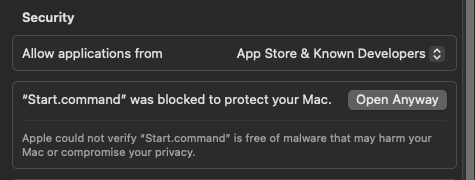

# Study tutor

GCSE revision that runs on your own computer. Maths is ready now (Edexcel
Foundation); science has started, and more subjects and boards are added as
pupils need them. Tell us which ones your child needs.

It works with no AI model at all. If you want the parts that use one, you add
a key from a model provider you pay for, and the key stays on your computer.
Your child's progress is kept in one folder on your computer, and none of it
is sent to us.

Setting it up takes about 15 minutes: download, first start and settings, 5 minutes each (an estimate).

## Download

- Windows: [StudyTutor-windows.zip](https://github.com/linardsb/study-tutor/releases/latest/download/StudyTutor-windows.zip)
- Mac: [StudyTutor-mac.zip](https://github.com/linardsb/study-tutor/releases/latest/download/StudyTutor-mac.zip)

The Windows zip is about 41 MB and the Mac zip about 47 MB. Allow 5 minutes.

## First start on a Mac

Allow 5 minutes.

1. Double-click `StudyTutor-mac.zip` to extract it. You get a folder called `StudyTutor` followed by a
   version number, for example `StudyTutor-0.1.2`. Move that folder somewhere that is not synced (see
   [Keep it out of OneDrive](#keep-it-out-of-onedrive-and-icloud)), such as a folder called `Tutor` in your
   home folder.
2. Open the folder and double-click `Start.command`.
3. The Mac says it cannot verify the file. Click **Done**.
4. Open **System Settings**, click **Privacy & Security**, scroll down to **Security**, and click
   **Open Anyway** next to the line about `Start.command`. Enter your password if asked.

   

5. Double-click `Start.command` again. If the Mac asks once more, choose to open it. A Terminal window
   opens with one line of text, then your browser opens on the tutor.

You only do steps 3 and 4 the first time for each version.

## First start on Windows

Allow 5 minutes.

1. Right-click `StudyTutor-windows.zip` and choose **Extract All**, then **Extract**. You get a folder
   called `StudyTutor` followed by a version number, for example `StudyTutor-0.1.2`. Extract it
   somewhere that is not synced (see [Keep it out of OneDrive](#keep-it-out-of-onedrive-and-icloud)), such
   as `C:\Tutor`.
2. Open that folder and double-click `Start.bat`.
3. If Windows says "Windows protected your PC", click **More info**, then **Run anyway**.
4. A black window opens with one line of text, then your browser opens on the tutor.

### The Windows firewall and the phone

Your child can photograph written working with a phone and send it to the tutor over your Wi-Fi. The
first time they click **Mark my written working**, Windows may ask whether to let StudyTutor use your
network.

- Allow it on private networks only.
- If Windows has your home Wi-Fi down as a public network, it blocks the phone even after you allow it.
  If it is your own home network, change it to private in Windows network settings.
- Windows asks again after each update, because each version is a new program to it.
- If the phone still cannot open the link, take the photo, move it to the computer, and use the link
  on that page to drop a photo on this computer instead.

## Keep it out of OneDrive and iCloud

Put the tutor's folder somewhere that is not synced to OneDrive, iCloud Drive, Dropbox or Google Drive.
Its `data` folder holds your child's records and your model key, and a synced folder copies both
online. Desktop and Documents are often synced without you knowing: OneDrive does this on many Windows
computers, and iCloud can on a Mac. A folder you make yourself, such as `C:\Tutor` on Windows or `Tutor`
in your home folder on a Mac, is safer.

## The settings page

Allow 5 minutes.

The first time, the home page lists three steps. The first is **Open settings**, and it is for a parent.

- **Provider**: pick the company whose model you pay for, or **No model**. With no model, lessons, practice
  and marking all work; only the parts that need a model are switched off.
The next two fields appear once you pick a provider.

- **Key**: paste the key from your provider's website. It is saved in the `data` folder on this computer
  and is only sent to that provider.
- **Tokens per month**: the most the tutor may use in a month, which puts a limit on the bill. When it is
  reached, the parts that need a model stop until the next month; everything else carries on.
- **Days a week with some practice**: the weekly target your child sees.

Click **Save**. You can come back to it from the **Settings** link at the bottom of the main page.

## Updating to a new version

When a new version is out, the tutor's main page says so and links to the download. Allow 10 minutes.

1. Stop the tutor: close the browser tab, then close the window that started it.
2. Download the new zip and extract it. It makes a new folder with the new version number, for example
   `StudyTutor-0.2.0`. Keep it next to the old one.
3. In the old folder, right-click the `data` folder and choose **Copy**. Open the new folder, right-click
   an empty space and choose **Paste** (on a Mac it says **Paste Item**).
4. Start the new version from its own folder and check your child's progress is there.
5. Only then delete the old folder.

Copy, do not move. Until step 5 the old folder still has everything, so you can go back to it.

- Do not copy the new folder over the old one.
- If the tutor asks for setup again, you started the new folder without its `data` folder. Close it and
  do step 3.
- The Mac or Windows warning from the first start comes back after each update, and so does the Windows
  firewall question. Answer them the same way.
- If the tutor stops with "this version of the tutor would lower progress", start the old folder again
  and tell us.

## Where the records live

All of your child's records are in the `data` folder inside the tutor's folder. To back
it up, copy that folder somewhere safe. Do not share `config.json` from it: it holds your key. Do not
move the tutor's folder into OneDrive or iCloud to back it up: that syncs the key too.

## Stopping the tutor

Close the browser tab, then close the window that started the tutor. On a Mac, click **Terminate** if it
asks.
